Admin Dashboard
===============

Introduction
-------------

The Admin Panel empowers Administrators to handle incoming and outgoing calls, as well as oversee communication with clients. It also tracks the issues faced by each client and maintains a record of their call history.

| The application grants Admins the capability to perform various call-related tasks such as initiating, answering, and transferring calls. 
| Additionally, they can oversee the performance of Agents through monitoring Live Status updates. 
| Admins are authorized to create or remove Agent accounts as needed. 
| In addition, they have the authority to allocate pending tickets to any extension based on the Ticket reports associated with each Agent.

Open a browser and Enter URL support.naasasecurities.com.np or Click `here <https://support.naasasecurities.com.np/>`_ to open Login page.

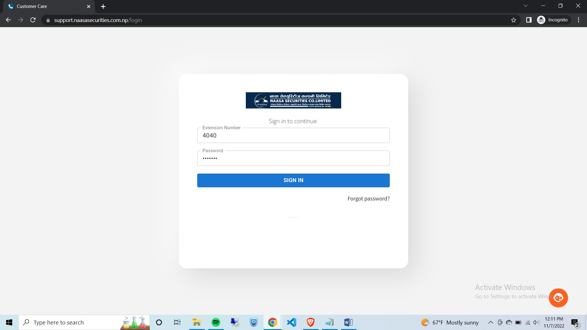

    Figure: Login page

* Please enter the unique credentials that have been provided to the agents, which include their extension number and password.
			
After entering the appropriate credentials, the dashboard displayed below will appear on the screen.

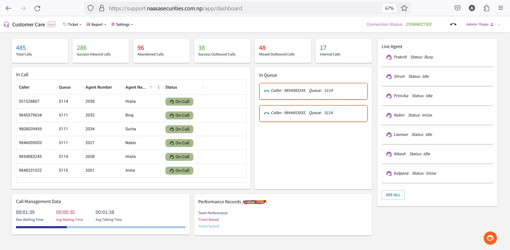

    Figure: Admin Dashboard 

Since it is the main page, it contains all the information.
    * The connection status is shown in the top right side of the Dashboard.
    * The dashboard includes statistics on the total number of calls, successful incoming calls, abandoned calls, successful outgoing calls, missed outgoing calls, and internal calls.

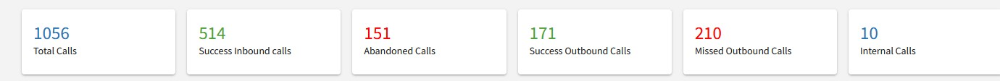

Component of Admin Dashboard
-----------------------------

In call
~~~~~~~

* The **Incall** section shows the ongoing calls, along with the caller's identification, queue number, and the agent's name and number.

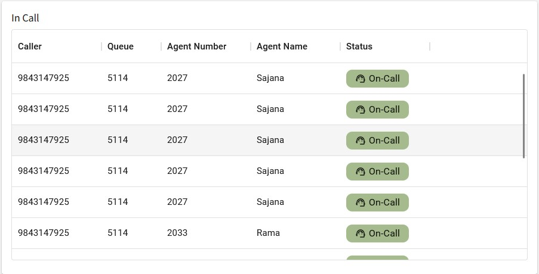

    Figure: Incall Section

Live Agent
~~~~~~~~~~~

* The **Live Agent** exhibits the current status of agents who are available and active, including their names and whether they are presently busy, idle, or engaged in a call.

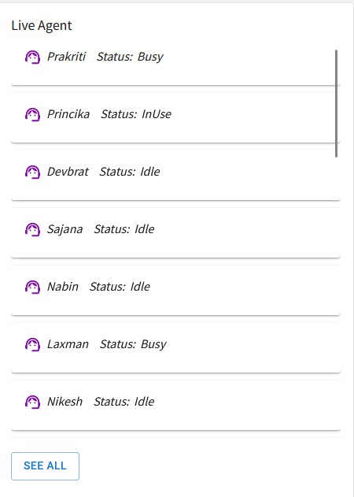

    Figure: Live Agent Section

When you click the **SEE ALL** button, you are directed to the Agent Status section where the status of all agents is listed.

In Queue
~~~~~~~~

* The **In Queue** section displays the phone calls from customers that are currently waiting in a queue, along with the caller's phone number and the assigned queue number.

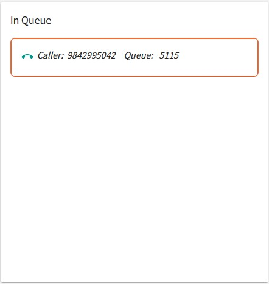

    Figure: In Queue Section

Call Management Data
~~~~~~~~~~~~~~~~~~~~~

It provides information on the maximum and average waiting times, as well as the average duration of conversations, between all agents and their customers.

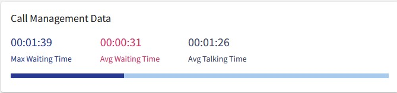

    Figure: Call Management Data

Ticket
-------

**To Navigate to the Ticket List**

To access the **Ticket List**, simply click on **Ticket** and then select **Ticket List**.

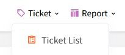

Ticket List
~~~~~~~~~~~~

This section presents a comprehensive list of all tickets, including the date they were created, the corresponding *ticket ID*, *customer phone number*, and *client ID*. Each ticket's status, whether it is pending, closed, or ongoing, is also indicated. Additionally, agents categorize the tickets based on their issue and sub-issue, and record the actions taken to address them, all of which are detailed in this section.

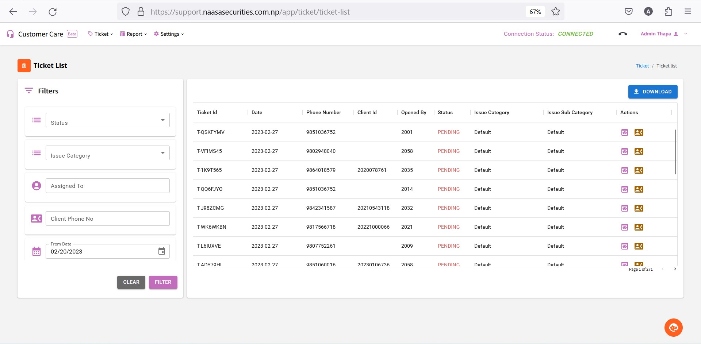

    Figure: Admin Ticket List

Filters
~~~~~~~~

* The ticket list can be filtered based on status, including options for pending and solved tickets. 
* Additionally, you can sort the list based on the issues categorized by the agents, or by the date, with the option to specify a time frame for the latter. 
* To access the ticket list for a specific client ID, simply enter the ID and click on the filter option.

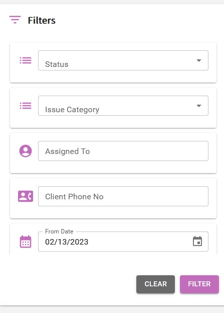

    Figure: Filters

.. note::
    You can download the the ticket list by clicking in the **download** button on the top-right side of the page.

Report
------

You can access different sub sections within the Report section by clicking on **Report** and selecting the sub section you wish to view.

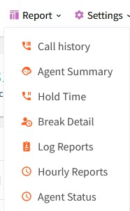

    Figure: Report Section

Call History 
~~~~~~~~~~~~~

* The Admin has the capability to retrieve the call history of the call center, which includes information such as the source and destination of calls made on a specific date, along with their respective time durations. 
* The call types are categorized as incoming and outgoing, and the status column specifies whether a call was answered, busy, unanswered, or abandoned. 
* Additionally, call recordings are also accessible through this feature.

Filter
^^^^^^

* It is possible to sort the call history by the extension number given to the agents
* You can also filter the call history by call status, and easily access the call records for incoming calls by selecting **inbound** from the dropdown menu. 
* Other options available in the call status dropdown menu include:
    * Inbound
    * Abandoned 
    * Inbound Success 
    * Outbound
    * Outbound Missed 
    * Outbound Success
* It is also possible to access the call history for specific numbers by entering their phone numbers.
* You can sort the call history by specifying a time frame and then selecting the Filter option.
* The Admin has the ability to download the call history list.

.. Attention:: 
    These following sections are under construction:
    * Agent Summary
    * Hold Time
    * Break Detail
    * Log Reports
    * Hourly Reports

Agent Status
~~~~~~~~~~~~

* This section displays the current status of all agents, including their name, extension number, and status. 
* A range of status options may be present, including ringing, unavailable, idle, busy, and in use.

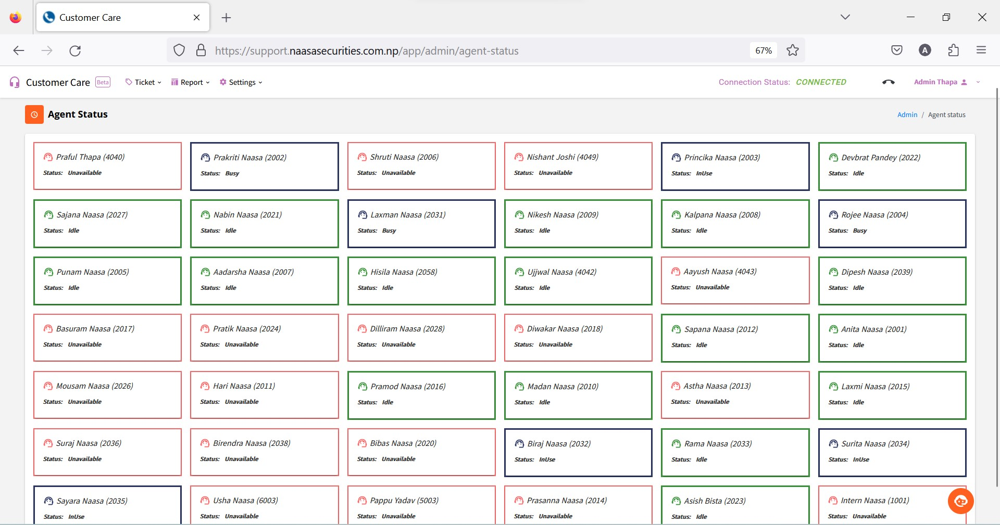

    Figure: Agent Status

Setting 
--------

At present, there is only one option available in the Setting section, which is Category Setup.

Category Setup
~~~~~~~~~~~~~~

* There are currently two issue categories available, but it is possible to add new categories based on the issues at hand.
* To add a new issue category, simply click the green button and create a new category for the issue. 
* Additionally, it is possible to edit, rewrite, or delete existing categories as needed.

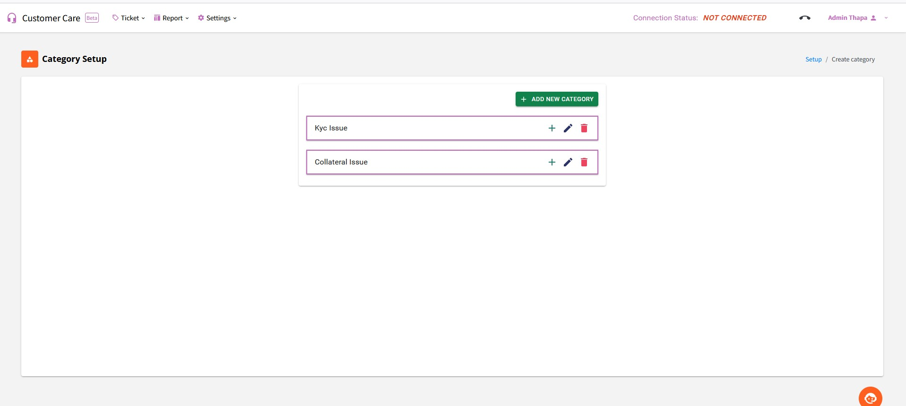

    Figure: Category Setup

    