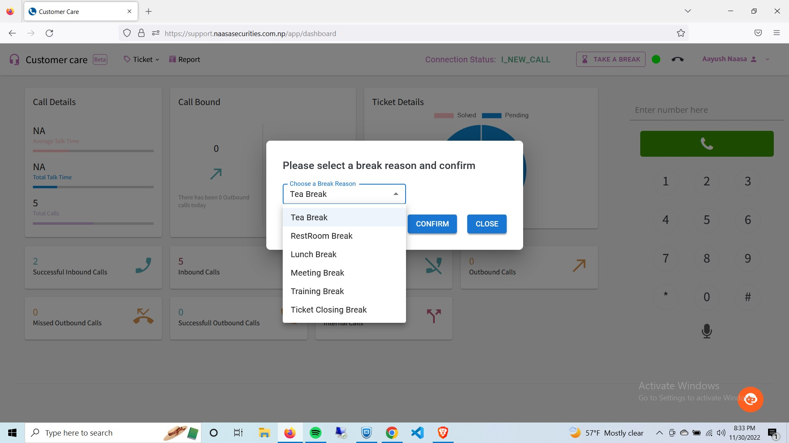

Agent Dashboard
================

Introduction
------------
| Within the application, agents have the ability to both receive calls from clients and make calls themselves. 
| Using various issue categories and subcategories, they can create tickets and choose whether to resolve them immediately or assign them to other agents based on the type of issue. 
| Additionally, agents can view call logs directly within the application.

Open a browser and Enter URL support.naasasecurities.com.np or Click `here <https://support.naasasecurities.com.np/>`_ to open Login page.

.. figure:: login.jpg

    Figure: Login page

* Please enter the unique credentials that have been provided to the agents, which include their extension number and password.
			
After entering the appropriate credentials, the dashboard displayed below will appear on the screen.

    Figure: Agent Dashboard 

Since it is the main page, it contains all the information.
    * The connection status is shown in the top right side of the Dashboard.
    * The call details is shown in the left side where the following details are shown:
        * Average Talk Time
        * Total Talk Time
        * Total Calls
    * The Incoming and Outgoing Call Details are displayed inside the Call Bound Section.
    * The Pie Chart Shows the Solved and Pending Ticket Details.
    * The Details of Calls are shown on the bottom half of the Dashboard.

Making and Receiving Calls
---------------------------

    Figure: Call Dialer in Dashboard

*   Click on the **Orange** Icon on the right bottom side of the screen to open the **Call Dialer**.
*	To initiate a call, enter the number or click on it using the dialpad.
*	If an agent receives a call from a client, a notification will appear. Upon clicking the notification, the agent will be redirected to the admin dashboard. From there, an incoming call popup, as shown in the figure **Incoming Call**, will appear. 
*	To Forward the Call press (*)2 and the Extension number. 

.. figure:: incoming_call.jpg
    :align: right

    Figure: Incoming Call

Ticketing System
----------------

When the Agent receives the call from the client, they are redirected to the create ticket page.

.. figure:: ticket.jpg

    Figure: Create a ticket page

* You can create two different types of issue categories from the dropdown menu.

    .. figure:: issue.jpg

                        Figure: Issue Category

* For each issue category, it is possible to create a dedicated sub-issue category.
* At present, the **collateral issue** comprises four sub-issue categories, which are also illustrated in the diagram.

    Figure: Sub-issue Category of Collateral issue 

* The **Kyc issue** comprises five sub-issue categories and that is also shown in the figure below.

* You also have the option to leave remarks in the designated area.
* If you believe that an issue requires further follow-up, you have the option to turn on the **Is further Followup Required** setting.
* It is possible to create a ticket even after a call has ended. For instructions on how to take a break from ticket closing, please refer to the **Break** section, which is explained in the Break Function.
* To include additional categories, please click on the **Add New Category** button located at the bottom of the page.

Break Function
--------------

Agents have the ability to take a break if necessary, during which they will not receive any calls. The steps to take a break are as follows.

* Click on Take a break on the right hand side of the navigation bar.
* Following window will appear where you can select the type of break from the dropdown menu.

    Figure: Types of Break

The **Take a Break** option will change to **End the Break** while on break, and you can click on it once you have finished your break.

    Figure: End Break Option

Report Section
---------------

To redirect to the **Reports** section, simply click on the **Reports** button from the *Navigation Bar*.

.. figure:: reports.jpg

    Figure: Report Section

You can keep track of following things from the Report Section:
    * Calls
    * Online Time & Break Time
    * Ticket Summary.
    
Furthermore, You can also filter the types of calls as shown in the figure given below.

    Figure: Types of Calls in Call Filter

* You can have more filter and sorting choices for each columns which is described in :ref:`Ability for extra control`.

Ticket List 
-------------

To access the **Ticket List**, simply click on **Ticket** and then select **Ticket List**.
Once you're there, you'll be able to view all of the tickets you've created and apply filters to refine your search.

* You can have more filter and sorting choices for each columns which is described in :ref:`Ability for extra control`.

    Figure: Ticket List

At present, there are two available methods for filtering the ticket list

* Sorting by date 
    - Specify the time frame, then select the **Filter** option.

    Figure: Date filter in Ticket List

* Sorting by Ticket status
    - Choose an option from the status dropdown menu, then click on the **Filter** button.

    
    Figure: Status Filter in Ticket List

* If you want to see more information about a ticket, simply click on the **View Ticket** option located under the **Actions** section.

    Figure: View Ticket

* You can have more filter and sorting choices for each columns which is described in :ref:`Ability for extra control`.

Assigned To Me Section
-----------------------

* To access the **Assigned To Me**, simply click on **Ticket** and then select **Assigned To Me**. 
* If you are able to view the page below, it indicates that you have successfully accessed the section.
* You can have more filter and sorting choices for each columns which is described in :ref:`Ability for extra control`.

    Figure: Assigned To Me Section

* Upon arriving at the page, you will be able to view the tickets that have been assigned to you, and apply filters based on status, issue category, or time.
* You can filter the tickets assigned to you by accessing the filter section located on the left side of the page.

    Figure: Filter section of Assigned To Me

* You can filter the list as according to the **Status** which include the following
    * Pending
    * Solved

* If you want to filter according to the issue category, you have two options as well.
    * Kyc Issue
    * Collateral Issue

* Furthermore you can also apply filter on the basis of time and client number.

Ability for extra control
---------------------------

* You are capable of exerting more extensive control over every single columns. 
* You are able to do so in list of  **Ticket List** , **Assigned To Me** and **Call History** sections.
* In order to do so, position your cursor on the specific column and locate the three dots icon. 
* By selecting this option, a menu will appear as illustrated in the following figure.

* You can sort the individual columns in ascending order and descending order.
* Furthermore you can filter individual columns with the filter value and operator as well as shown in the figure below.

* If you want to hide specific columns you can also do so by simply click on the hide option.
* Futher If you want to show the columns that you hide earlier, click on the **Show Columns** option.
* The menu shown below will appear and you can hide all the columns or show all the columns.
* Or you can enable the specific columns of your want.

