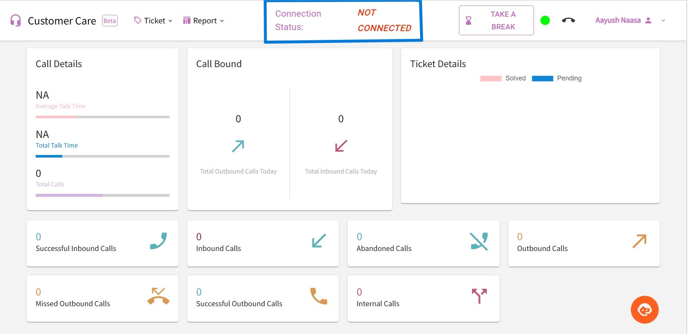
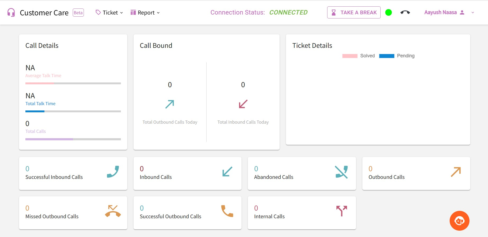

Troubleshooting
================

This is a guide that outlines how to address potential challenges that may arise when using a call center website. 
It covers various issues that can be resolved by the end user.

Objectives
----------

* To provide a step-by-step guide to troubleshoot common issues that may arise while using Call Center Website of Naasa Securities.
* To identify the cause of the problem and take the necessary steps to resolve it.

Problems and Issues
-------------------

* WebRTC Failure
* Notification Failure
* Audio Failure

WebRTC Failure
--------------

**WebRTC Failure** is the situation where WebRTC Technology encounters an isuue that prevents it from working correctly

It inculdes following issues:

* Delay in joining call
* Not receiving call
* Dropped Connections
* Failure to establish connection 

Dropped Connection or Failure to establish connection  
~~~~~~~~~~~~~~~~~~~~~~~~~~~~~~~~~~~~~~~~~~~~~~~~~~~~~

The reasons for encountering this issue is as follow: 

* Attempting to access the website from a network other than the host may result in this issue.

    Figure 1: Connection Failure

Troubleshooting Steps
^^^^^^^^^^^^^^^^^^^^^

* Perform a hard refresh by pressing Ctrl + Shift + R.
* Ensure that you have identified the host network.
* Please connect to the host network.
* Once connected to the host network, please refresh the page.
* After completing all the necessary steps, the connected status will be shown/displayed.

    Figure 2: Connected Status 

Failed to receive call
~~~~~~~~~~~~~~~~~~~~~~~

The reasons for encountering this issue is as follow: 
 
* This happens when your account is also logged in from another location.

Troubleshooting Steps
^^^^^^^^^^^^^^^^^^^^^

* Perform a hard refresh by pressing Ctrl + Shift + R.
* Ensure that your account is not currently logged in from another location. 

Delay in joining call
~~~~~~~~~~~~~~~~~~~~~

* The reason for experiencing a delay in joining the call is may be due to the browser being used.
* It also cause due to the slow internet.

Troubleshooting Steps 
^^^^^^^^^^^^^^^^^^^^^

* Perform a hard refresh by pressing Ctrl + Shift + R.
* To address this problem, it is advisable that you use **Mozilla Firefox**.
* Additionally, make sure to check the speed of the WiFi you are currently using.

Notification Failure
---------------------

This is the situation where you do not receive notifications.
| The reasons for encountering this issue is as follow: 

* This could be because you have disabled your notification settings.
* This can also occur if you have not granted access permission to that website.

Troubleshooting Steps
^^^^^^^^^^^^^^^^^^^^^^

* Grant permission for notifications.
    * To enable permission, click on the displayed button and choose **More Information**.

.. figure:: permission.jpg

   Figure 1

    * A Page info box will pop up as Following:

.. figure:: pageinfo.jpg

   Figure 2

    * Click On Permission and Allow the necessary permissions as shown above.

Audio Failure
--------------

**Audio Failure** refers to an occurrence wherein the audio equipment or device is not operating properly, leading to either the absence of sound or inferior sound quality.

| The reasons for encountering this issue are as follows:

* This could happen if the volume of the system is turned off.

    Figure: Sound off

* Audio failure can also be caused by a malfunctioning headset or if your laptop is unable to detect it.
* Muting the site may cause audio failure.

Troubleshooting Steps
^^^^^^^^^^^^^^^^^^^^^^^

1. Verify whether the system volume is turned on.
    * To adjust the system volume, you can click on the sound icon, as indicated in the figure.

    .. figure:: soundon.jpg

        Figure: Sound On

2. Ensure that both your headset is functioning properly and that your system is able to detect it.
    * To verify if your system is detecting the headset, click on the sound icon located at the bottom-right corner of your window. 
    * This will open an interface that looks similar to the following.

    .. figure:: check.jpg

    * Click on the right-hand side of the sound section to open an interface that looks like the following.

    .. figure:: soundoutput.jpg

        Figure: Sound Output
    
    * If your system has successfully detected and is functioning properly with your headset, its name will be displayed there as above.

3. Ensure that the site is not muted.
    * To unmute your site, right-click on its title, which will open a menu as given below. 

    .. figure:: unmute.jpg

        Figure: Unmute Tab

    * Then, select **the unmute tab** option to restore audio to the site.
    * You can also use the shortcut Ctrl + M to unmute the site directly.

