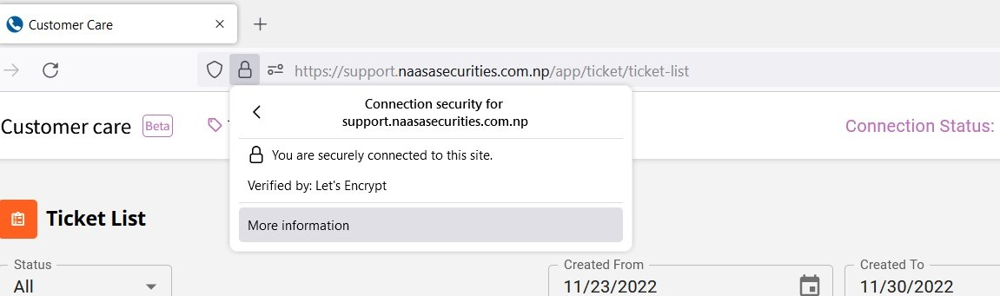
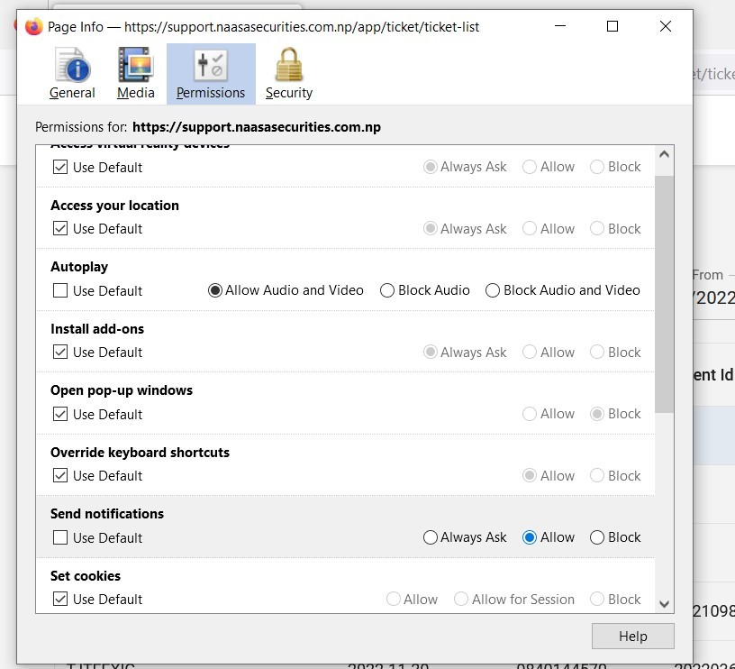

Introduction to Naasa Call Center
===================================

**Naasa Call Center** is inhouse project of **Naasa Securities** which allows the agents to *send*, *receive* and *track* calls with the clients.
It also tracks the issues and call history of the clients individually.

Prerequisite:
-------------
   * Mozilla Firefox
   * Permission for Microphone, Audio and Push Notification

* To allow Permission Click on the button as shown and select More Information.

   Figure 1

* A Page info box will pop up as Following:

   Figure 2

* Click On Permission and Allow the necessary permissions as shown above.

.. note::

   This project documents the call center operations of Naasa Securities.

Contents
--------

.. toctree::

   Agent Dashboard
   Admin Dashboard
   Trouble Shoot

